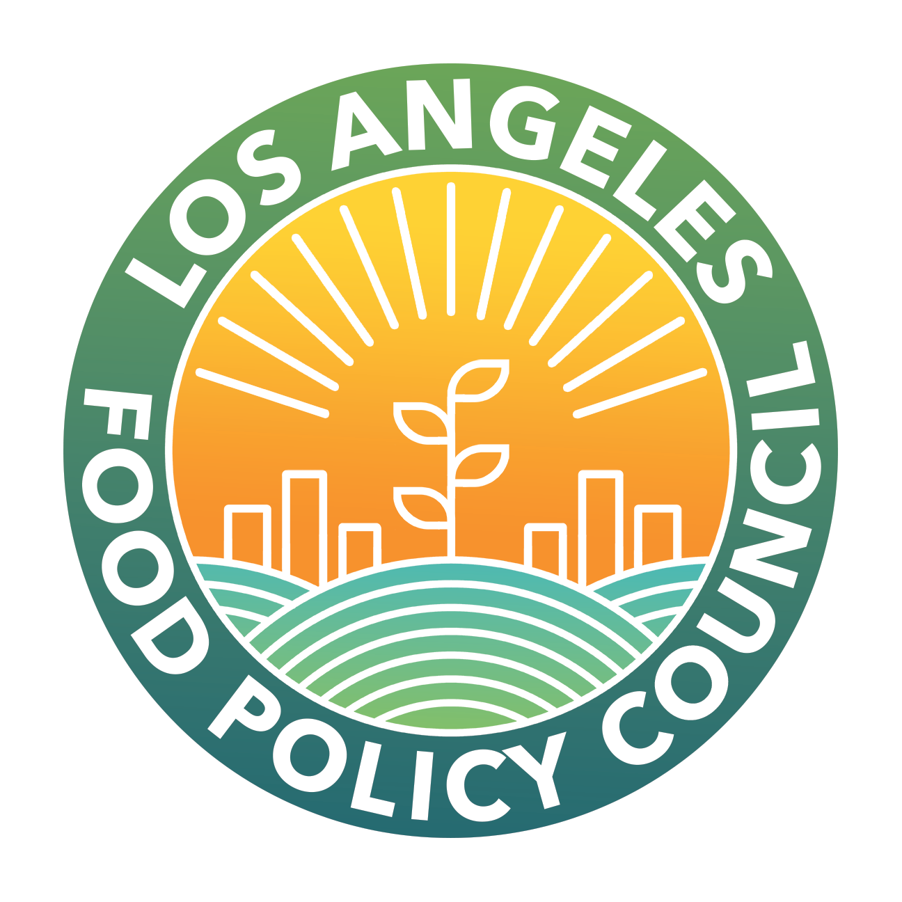

 
# LA Policy Food Council
About the LA Food Policy Council [from their website](https://www.goodfoodla.org/):
LA Food Policy Council's **Mission**:
> The Los Angeles Food Policy Council (LAFPC) works to ensure food is healthy, affordable, fair and sustainable for all.
LA Food Policy Council's **Vision**:
> We believe Good Food for All is possible and that all communities deserve access to good food, grown in a way that respects people and the planet. We work to create a local food system free from hunger, rooted in equity and access, supportive of farmers and food workers, and guided by principles of environmental stewardship and regeneration. To accomplish our vision of Good Food for All, we catalyze, coordinate and connect people across the LA region, including government, business and community groups working on food.
> The Los Angeles Food Policy Council serves as backbone organization for a network of over 400 organizations and agencies working for healthy, sustainable and fair food.

### User Story
There are two users for this dashboard, the admin user and the public user.
1. Admin - this user should be able to update, delete, and maintain the content and data published on the dashboard using a google drive of google sheets where the relevant data is organized and updated/removed as needed.
2. Public - this user should be able access the dashboard by visiting the URL to view the the home page and four value pages, the public user should be able to filter for specific indicators/demographics/geographic locations, and download the "toolkit" containing a full report, value report, raw data, and fast facts sheet. 

### Our Team
- Ruben Baez (UX/UI, Product Designer)
- Alexander Hoskinson (Developer)
- Erin Johnson (Developer)
- Narek Khachatryan (Developer)
- Jennifer Sloane (UX/UI, Product Designer)
- Preston Wheeler (UX/UI, Product Designer)

### Technologies Used
- Javascript
- HTML
- CSS
- Node.js
- React
- Google Firebase
- Google Drive
- Figma