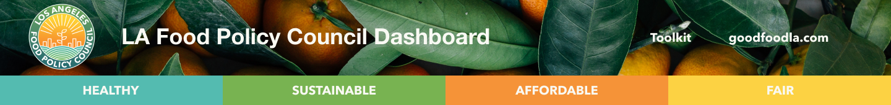
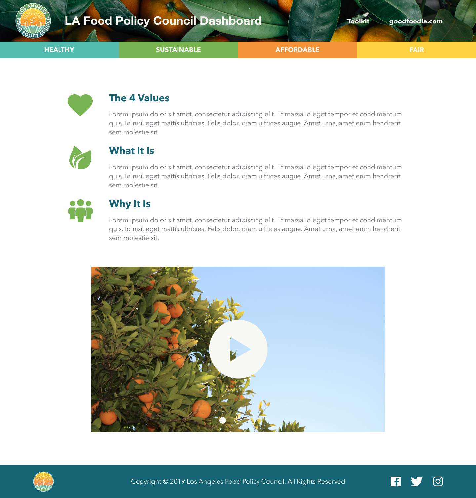
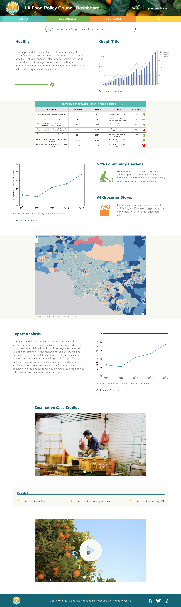

# LA Food Policy Council Dashboard (General Assembly Social Impact Hackathon)

[LA Food Policy Council](https://www.goodfoodla.org/) (LAFPC) "serves as [the] backbone organization for a network of over 400 organizations and agencies working for healthy, sustainable and fair food."  In order to provide relevant and reliable data to these organizations, to policy-makers, and to members of the community, LAFPC needs a **dashboard** that displays this data in a digestible way that can be used by these organizations and individuals to effect change in their communities and to work toward LAFPC's **Mission**, "to ensure food is healthy, affordable, fair and sustainable for all."  General Assembly partnered with LA Food Policy Council for a Social Impact Hackathon where four teams of UX Designers and Software Engineers partnered up to create a Food System Dashboard for LAFPC to better serve their community in the name of "Good Food For All." 

### Crowd Favorite!
After three days of intense working, our team’s hard work paid off. Our web app won the “Crowd Favorite Award” at the General Assembly Social Impact Hackathon. We are all very proud of our project and of each other!

## [Go to the dashboard](https://lafpc-food-dashboard.firebaseapp.com/)

### Our Team
- Alexander Hoskinson (Developer) ([Github](https://github.com/alexander215), [LinkedIn](https://www.linkedin.com/in/alexhoskinson/), [Portfolio](https://alexhoskinson.com/))
- Erin Johnson (Developer) ([Github](https://github.com/erinjohnson47), [LinkedIn](https://www.linkedin.com/in/erinjohnson47/))
- Jennifer Sloane (UX/UI, Product Designer) ([Portfolio](https://www.jenniksloane.com/), [LinkedIn](https://www.linkedin.com/in/jenniksloane/))
- Narek Khachatryan (Developer), ([Github](https://github.com/narex111), [LinkedIn](https://www.linkedin.com/in/narekkhachatryan/))
- Preston Wheeler (UX/UI, Product Designer) ([Portfolio](https://www.prestonwheeler.com/), [LinkedIn](https://www.linkedin.com/in/prestonwheeler/))
- Ruben Baez (UX/UI, Product Designer) ([Portfolio](https://www.rubenbaez.com/), [LinkedIn](https://www.linkedin.com/in/rubenbaez/))

### Technologies Used
- Javascript
- HTML
- CSS/Styled Components
- React
- Node.js
- Google Firebase/Realtime Database
- Google Drive
- Figma

### User Stories
There are two users for this dashboard, the admin user and the public user.
1. **Admin** - this user should be able to update, delete, and maintain the content and data published on the dashboard using a google drive of google sheets where the relevant data is organized and updated/removed as needed.
2. **Public** - this user should be able access the dashboard by visiting the URL to view the home page and four value pages, the public user should be able to filter for specific indicators/demographics/geographic locations, and download the "toolkit" containing a full report, value report, raw data, and fast facts sheet. 

### UX Design High-Fidelity Prototypes
As software engineers, this was our first time getting the opportunity to work with ux designers.  They did extensive research (within the time constraints of the hackathon) and then designed a beautiful prototype for us to build.  It was a great experience and a lot of fun!

#### The Home Page of the Food System Dashboard

### Healthy Value Page
